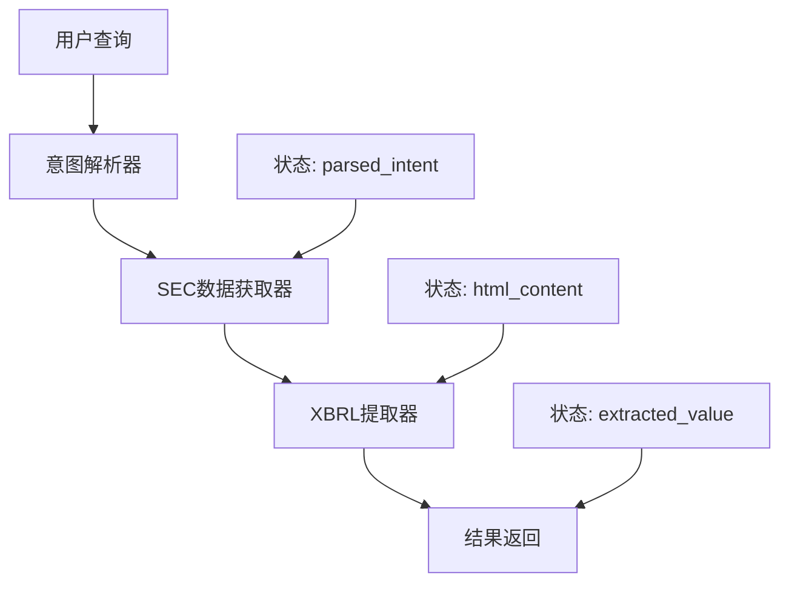

# 技术文档：InsightAgent MVP v1.0

## 1. 项目概览

### 1.1 项目定位与发展路线

#### 长期愿景
InsightAgent的最终目标是成为一个智能的财报对话助手，能够通过自然对话的方式帮助用户深入分析财报数据，理解公司财务状况。这个目标将通过渐进式演进来实现，确保每一步都建立在可靠的数据基础之上。

#### 当前阶段（MVP 1.0）
在通向对话式交互的路径上，当前版本专注于解决最基础且最关键的问题：**确保单点查询的数据准确性**。这是实现后续对话能力的基石。

1. **已实现的能力**
   ```
   ✓ 单指标查询："苹果公司2023年的收入是多少？"
   ✓ 多年份查询："MSFT 2021和2022年的净利润是多少？"
   ✓ 指定报告："查询特斯拉2023年Q3的总资产"
   ```

2. **查询精度保证**
   - 使用官方SEC EDGAR数据源
   - 基于XBRL标准标签提取
   - 保留原始单位和上下文
   - 提供数据来源链接

3. **当前阶段限制**（后续版本将逐步突破）
   - 每次查询限于单个具体指标
   - 需要明确指定公司、年份、指标
   - 暂不支持数据比较和推理
   - 暂未实现对话上下文保持

#### 技术路线与演进
1. **第一阶段**（当前MVP）
   - 核心目标：建立可靠的数据获取基础设施
   - 技术重点：确定性RAG架构，确保数据准确性
   - 关键指标：查询准确率、数据可溯源性

2. **第二阶段**（计划中）
   - 核心目标：引入基础的对话能力
   - 技术重点：状态管理、上下文保持、多轮对话
   - 预期功能：
     * 支持简单的数据比较（"比去年增长了多少？"）
     * 支持基础指标推理（"毛利率是多少？"）
     * 记住上一轮查询的上下文

3. **第三阶段**（Maybe）
   - 核心目标：深度财报分析对话
   - 技术重点：知识图谱、因果推理、多维分析
   - 预期功能：
     * 财务指标趋势分析
     * 跨公司数据比较
     * 财务健康度评估
     * 异常指标解释

#### 技术路线选择
选择"先确保查询准确，再拓展对话能力"的原因：
1. **数据可靠性**: 对话系统的质量直接依赖于底层数据的准确性
2. **可验证性**: 建立可追溯的数据提取机制，为后续分析提供可靠基础
3. **渐进式发展**: 通过逐步演进降低开发风险，确保每个阶段都有稳定产出
4. **用户信任**: 从高准确率的单点查询开始建立用户信任

### 1.2 项目目标
InsightAgent是一个基于LangGraph的智能财报分析助手，旨在通过自然语言交互方式，从SEC的10-K和10-Q财报中精确提取财务数据。系统采用确定性RAG架构，通过解析结构化的XBRL标签来确保数据提取的准确性。

### 1.2 技术栈
- **Python 3.8+**: 核心开发语言
- **LangGraph**: 工作流编排框架
- **OpenAI GPT-3.5-turbo**: 自然语言理解
- **BeautifulSoup**: iXBRL/XML解析
- **Requests**: HTTP客户端

### 1.4 系统架构
系统采用"LangGraph工作流编排 + 微服务工具集"的模式。该架构将复杂的数据提取过程解耦为独立的、可控的节点，由一个状态图（StateGraph）进行统一编排和调度。这种设计使得系统具有良好的可维护性和扩展性。

## 2. 工作流组件和数据流

### 2.1 核心工作流组件
1. **意图解析器** (Intent Parser)
   - 输入：用户自然语言查询
   - 输出：结构化的查询意图（公司、年份、指标）
   - 实现：OpenAI GPT-3.5-turbo

2. **SEC数据获取器** (SEC Retriever)
   - 输入：公司CIK、年份、报告类型
   - 输出：iXBRL格式的财报文件
   - 实现：SEC EDGAR API

3. **XBRL提取器** (XBRL Extractor)
   - 输入：iXBRL文件、目标指标标签
   - 输出：财务数值和单位信息
   - 实现：BeautifulSoup XML解析

4. **工作流编排器** (Workflow Orchestrator)
   - 输入：各组件的状态和输出
   - 输出：最终的查询结果
   - 实现：LangGraph状态图

### 2.2 完整数据流转过程


### 2.3 状态管理
系统使用`WorkflowState`对象管理整个流程的状态：
```python
WorkflowState = {
    "query": str,              # 用户原始查询
    "parsed_intent": dict,     # 解析后的结构化意图
    "html_content": str,       # SEC iXBRL内容
    "extracted_value": dict,   # 提取的财务数据
    "error": str,              # 错误信息
    "success": bool            # 执行状态
}
```

## 3. 模块详解

### 3.1 配置管理模块 (`config.py`)

#### 功能和职责
集中管理所有配置项，包括API密钥、URL、公司映射等。这种集中式配置管理便于在不同环境中切换配置，提高了系统可维护性。

#### 主要配置项
- **OpenAI配置**: API密钥、模型选择、参数设置
- **SEC API配置**: 基础URL、用户代理、请求延迟
- **公司映射**: TICKER_TO_CIK字典（股票代码→CIK号）
- **XBRL配置**: 默认标签和解析器设置

### 3.2 SEC数据获取模块 (`sec_retriever.py`)

#### 功能和职责
负责与SEC EDGAR数据库交互，获取财报文件。在工作流中承担"数据获取"节点的角色。

#### 数据获取链路
1. **获取文件索引**
   ```
   背景: SEC EDGAR是美国证券交易委员会的官方文件数据库，所有上市公司都必须在这里提交财报。
   每个公司都有唯一的CIK号码（Central Index Key）作为标识。
   
   输入: CIK号码
   API: https://data.sec.gov/submissions/CIK{cik}.json
   输出: 公司提交历史（JSON）
   速率限制: 10次请求/秒
   ```

2. **定位目标文件**
   ```
   背景: 每份财报都有唯一的访问号（accessionNumber）和主文档名（primaryDocument）。
   系统需要在所有提交记录中找到特定年份和类型（10-K/10-Q）的文件。
   
   输入: 提交历史JSON
   处理: 根据年份和报告类型筛选
   输出: accessionNumber和primaryDocument
   ```

3. **下载财报文件**
   ```
   背景: SEC采用标准化的URL结构来访问具体的财报文件。
   所有文件都以iXBRL格式提交，这是一种将结构化数据嵌入HTML的格式。
   
   URL构造: https://www.sec.gov/Archives/edgar/data/{cik}/{accession_number}/{primary_document}
   输出: iXBRL格式文件（HTML + XBRL标签）
   ```

#### 当前局限性
1. **年份匹配问题**
   - 核心问题：使用提交日期（filingDate）而不是报告期（periodOfReport）来匹配年份
   - 影响：当财年与日历年不一致时，可能返回错误的财报
   - 解决方向：改用periodOfReport字段，并添加财年处理逻辑

2. **公司支持受限**
   - 核心问题：在config.py中硬编码了8家公司的CIK映射
   - 影响：无法支持其他上市公司的查询
   - 解决方向：对接SEC的公司映射API，支持所有上市公司

3. **请求限制处理**
   - 核心问题：简单的time.sleep实现，没有智能的重试机制
   - 影响：在网络问题或限速时容易失败
   - 解决方向：实现指数退避重试和请求队列

### 3.3 XBRL提取模块 (`xbrl_extractor.py`)

#### 功能和职责
系统的核心执行工具，负责从iXBRL文件中精确提取财务数据。在工作流中承担"数据提取"节点的角色。

#### 数据提取流程
1. **文档解析**
   ```python
   # iXBRL是一种特殊的HTML文件，包含了机器可读的XBRL标签
   # 使用xml解析器以保证标签解析的准确性
   soup = BeautifulSoup(html_content, 'xml')
   ```

2. **标签定位**
   ```python
   # ix:nonFraction是XBRL中表示数值的标准标签
   # name属性使用us-gaap命名空间，这是美国通用会计准则的标准
   tag = soup.find('ix:nonFraction', {'name': metric_tag})
   ```

3. **数据提取**
   ```python
   # 提取标签文本作为数值，unitRef属性指示单位（如USD）
   value = tag.text
   unit = tag['unitRef']
   context_ref = tag['contextRef']  # 用于确定时间范围
   ```

#### iXBRL数据格式示例
```xml
<!-- 收入数据点 -->
<ix:nonFraction name="us-gaap:Revenues" 
                unitRef="USD" 
                contextRef="c1">100000</ix:nonFraction>

<!-- 时间上下文定义 -->
<xbrli:context id="c1">
    <xbrli:period>
        <xbrli:startDate>2021-01-01</xbrli:startDate>
        <xbrli:endDate>2021-12-31</xbrli:endDate>
    </xbrli:period>
</xbrli:context>
```

#### 当前局限性
1. **上下文匹配问题**
   - 核心问题：使用soup.find()只返回第一个匹配项
   - 影响：无法区分同一指标在不同时间段的数据
   - 解决方向：实现基于contextRef的精确时间匹配

2. **数值处理不完善**
   - 核心问题：未处理单位换算和特殊格式
   - 影响：
     * "(123)"格式的负数无法正确解析
     * "in millions"等单位说明被忽略
     * 千分位逗号导致解析错误
   - 解决方向：添加数值清洗和单位换算逻辑

3. **标签兼容性问题**
   - 核心问题：不同公司可能使用不同的XBRL标签表示同一指标
   - 影响：部分公司的数据无法提取
   - 解决方向：建立完整的标签映射知识库

### 3.4 工作流编排模块 (`langgraph_orchestrator.py`)

#### 功能和职责
系统的"大脑"，负责定义和控制整个业务流程。使用LangGraph框架实现工作流的状态管理和节点调度。

#### 核心节点
1. **parse_intent_node**
   - 功能：将自然语言转换为结构化查询
   - 输入：用户查询
   - 输出：{ticker, year, metric}
   - 实现：使用OpenAI API进行意图解析

2. **retrieve_sec_data_node**
   - 功能：获取SEC文件
   - 输入：parsed_intent
   - 输出：html_content
   - 实现：调用SEC retriever模块

3. **extract_xbrl_data_node**
   - 功能：提取财务数据
   - 输入：html_content, metric_tag
   - 输出：extracted_value
   - 实现：调用XBRL extractor模块

#### 指标映射示例
```python
# 当前的硬编码映射表
METRIC_TAG_MAPPING = {
    "Revenues": [
        "us-gaap:Revenues",  # 最常用
        "us-gaap:RevenueFromContractWithCustomerExcludingAssessedTax",  # 部分公司使用
        "us-gaap:SalesRevenueNet"  # 零售行业常用
    ],
    "NetIncome": [
        "us-gaap:NetIncomeLoss",
        "us-gaap:ProfitLoss"  # 国际公司可能使用
    ],
    # ... 其他映射
}
```

#### 当前局限性
1. **工作流控制问题**
   - 核心问题：简单的线性工作流，缺乏分支和重试逻辑
   - 影响：
     * 单个节点失败导致整个流程失败
     * 无法处理需要多次尝试的情况
     * 缺乏数据验证和回退机制
   - 解决方向：
     * 添加Fallback节点处理失败情况
     * 实现Reflection节点支持自我修正
     * 添加数据验证节点

2. **指标映射问题**
   - 核心问题：硬编码的METRIC_TAG_MAPPING维护困难
   - 影响：
     * 新指标添加需要修改代码
     * 无法动态更新映射关系
     * 缺乏行业特定的标签支持
   - 解决方向：
     * 创建外部指标知识库
     * 支持动态更新映射
     * 添加行业特定映射

3. **状态管理局限**
   - 核心问题：状态对象结构固定，不支持动态字段
   - 影响：
     * 难以添加新的处理节点
     * 中间状态信息丢失
     * 调试困难
   - 解决方向：
     * 实现可扩展的状态对象
     * 添加状态历史记录
     * 增强调试信息

### 3.5 测试系统现状

#### 当前测试覆盖
1. **基础功能测试** (`test_basic_functionality.py`)
   - 模块导入测试
   - 配置验证
   - 简单的XBRL提取测试（使用mock数据）

2. **SEC检索测试** (`test_sec_retriever.py`)
   - 基本的网络连接测试
   - 错误处理测试
   - 请求限制测试

3. **工作流测试** (`test_langgraph_orchestrator.py`)
   - 状态管理测试
   - 节点流转测试
   - 错误处理测试

4. **集成测试** (`test_integration.py`)
   - 端到端功能测试
   - API一致性测试
   - 性能基准测试

#### 测试数据集局限性
1. **缺乏真实数据样本**
   - 当前主要使用简单的mock数据
   - 没有足够的真实XBRL文件样本
   - 缺乏不同公司、不同年份的对照数据

2. **覆盖场景不足**
   - 缺乏复杂XBRL格式测试
   - 缺乏非标准财年测试
   - 缺乏特殊数值格式测试（如负数、单位换算）

3. **验证深度不够**
   - 数据准确性验证依赖人工核对
   - 缺乏自动化的数据验证机制
   - 缺乏边界情况测试

#### 改进方向
1. **建立测试数据集**
   - 收集真实的SEC文件片段
   - 构建标准的测试用例库
   - 添加已知的特殊情况样本

2. **增强测试覆盖**
   - 添加复杂XBRL格式测试
   - 添加财年处理测试
   - 完善数值处理测试

3. **改进验证机制**
   - 实现自动化数据验证
   - 建立测试数据基准
   - 添加性能测试基准

## 4. 系统局限性和改进方向

### 4.1 当前局限性
1. **数据准确性问题**
   - 年份匹配不精确
   - 指标映射不完整
   - 数值格式处理不完善

2. **系统健壮性问题**
   - 错误处理机制简单
   - 缺乏重试机制
   - 无数据缓存

3. **扩展性问题**
   - 公司支持有限
   - 指标映射维护困难
   - 测试覆盖不足

### 4.2 改进方向
1. **短期优化**
   - 实现上下文精确匹配
   - 外部化指标知识库
   - 完善数值处理

2. **中期规划**
   - 建立公司映射知识库
   - 重构测试系统
   - 优化财年匹配

3. **长期目标**
   - 增强错误处理
   - 实现数据缓存
   - 支持批量查询